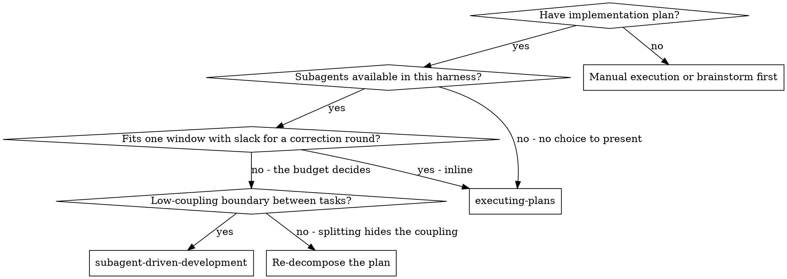

# Execution Path Criterion — Context Budget and Coupling Implementation Plan

> **For agentic workers:** REQUIRED SUB-SKILL: Use superpowersplus:subagent-driven-development or superpowersplus:executing-plans to implement this plan task-by-task — the `**Execution:**` field below names which of the two this plan was handed to, and that is the one to follow. Steps use checkbox (`- [ ]`) syntax for tracking.

**Source spec:** `docs/superpowers/specs/2026-08-21-execution-path-context-budget-design.md`

**Goal:** Replace the temporal criterion that selects between inline and subagent execution ("does it finish in one sitting") with two questions — does the plan fit in one context window with slack for a correction round, and is there a low-coupling boundary — stated once and pointed to from all three skills that carry it today.

**Architecture:** One new reference file under `skills/writing-plans/references/` becomes the single statement of the criterion; the three `SKILL.md` files that repeat it today link to it instead. One new document under `docs/` records the third-party measurement the rule rests on. No script changes, no reviewer-prompt changes, and no new machinery — coupling enters as content of two nodes that already exist.

**Tech Stack:** None. This is a zero-dependency plugin of markdown skills; the spec's `## External Dependencies` says "None". The only executables involved are gates already in this repository. The four the spec's `IR6` names: `scripts/check-links.sh`, `scripts/check-changelog.sh`, `scripts/check-docs-sync.sh`, and the `SKILL.md` line ceiling (`scripts/check-skill-size.sh`). Two more are in play because the files this plan edits are declared carriers of a copied form: `scripts/check-escalation-shape.sh` and `scripts/check-evidence-line.sh`.

**Execution:** `inline` — progress recorded in session todos (not persisted). Chosen 2026-08-21 by the criterion this plan institutes: 5 tasks across 6 files, low-coupling boundaries present but the plan is small enough that the handoff cost outweighs them.

> **Superseded text, marked rather than converted — 2026-08-21, after the
> branch review.** The coupling boundary this plan prescribes at lines 255,
> 374 and 601 reads "stop having all three" / "stop sharing a file, an
> interface and state". That wording is **wrong and was corrected in the
> branch**: coupling is disjunctive — any one of the three ties two tasks
> together — so the boundary is where they share **none** of the three. The
> current wording is in
> [`execution-path.md`](../../../skills/writing-plans/references/execution-path.md).
> This plan is a record of work already done and is not rewritten to match;
> converting it would produce a document that looks as though it had passed
> the gates in its corrected form. Read those three blocks as history.

**Escalation shape** (detail and a worked example: `../using-superpowers/references/escalation-format.md`):
1. **What breaks or costs** if nothing is decided — one sentence, the consequence and not the mechanism.
2. **2–4 options with the cost of each**, always including doing nothing now.
3. **A recommendation naming which source backs it** — a project pattern at `file:line`, the dependency's official docs, or general practice declared as such.
4. **Before sending, reread the whole message once**, looking for terms someone outside this project would not know. Rewrite each in plain language, or define it in the sentence that uses it. A gate verdict name (`LOST IN TRANSLATION`, `INVENTED SCOPE`, …) appears only in parentheses, never carrying the explanation.

## Global Constraints

Every task's requirements implicitly include this section.

- **No new dependency.** This is a zero-dependency plugin. Nothing installs, nothing is imported.
- **No script under `skills/*/scripts/` is modified, and no reviewer prompt is modified** (spec `IR5`). The reviewer prompts are `skills/subagent-driven-development/task-reviewer-prompt.md`, `re-review-prompt.md`, `implementer-prompt.md`, `skills/requesting-code-review/code-reviewer.md`, `skills/brainstorming/spec-document-reviewer-prompt.md`, `skills/writing-plans/plan-document-reviewer-prompt.md`.
- **`skills/writing-plans/SKILL.md` must end at or under 500 lines** — `scripts/check-skill-size.sh:34` sets `MAX=500`, and the file stands at 486. A body over the ceiling is fixed by moving content to `references/`, never by compressing it.
- **A staged change under `skills/` needs `CHANGELOG.md` staged in the same commit** — `scripts/check-changelog.sh` in the pre-commit hook enforces it. Every task below that touches `skills/` adds its own line to the existing `## [Unreleased]` section and stages both together.
- **Do not alter the escalation shape or the evidence line in any file.** `skills/writing-plans/SKILL.md` and `skills/executing-plans/SKILL.md` are declared carriers of both forms (`scripts/check-escalation-shape.sh:51-56`, `scripts/check-evidence-line.sh:62-69`), and `skills/subagent-driven-development/SKILL.md` of the first. The gates fail when carriers disagree.
- **The new reference file must NOT carry the escalation shape or the evidence line.** Both carrier lists are declared, not discovered (`scripts/check-escalation-shape.sh:22-23`): a seventh carrier means editing the gate, which this plan does not do.
- **A pointer to a file of this repository is a markdown link, never backticks.** Backticks are reserved for paths that deliberately do not resolve.
- **`docs/context-budget.md` sits at the first level of `docs/` and is therefore governed by the third-party link diet.** Four host prefixes are allowed, none of which covers the sources; the sources are named in text, with no URL.

## Test Coverage Matrix

**How this repository tests a change to skill content, recorded rather than imported.** There is no unit-test layer for markdown prose here. What exists is a set of gate scripts that assert facts about skill files — `scripts/check-skill-size.sh` asserts a line ceiling, `scripts/check-escalation-shape.sh:51-56` and `scripts/check-evidence-line.sh:62-69` assert that a copied form agrees across declared carriers, `scripts/check-links.sh` asserts that pointers resolve — each with its own suite under `tests/hooks/` and its own CI step (`.github/workflows/ci.yml:60-77`). Content criteria that no existing gate covers are verified by an exact `grep`, named per row and run as a step inside the task that creates the content.

**No adversarial behavior record is added.** `tests/skill-behavior/README.md` describes the pattern for measuring whether a rule changes what an agent does; no `AC` or `IR` in the source spec asks for behavioral proof, and adding one would be scope the spec does not carry.

| Criterion | Spec criterion | Test type | Layer | Test |
|-----------|----------------|-----------|-------|------|
| T1.1 The evidence document exists and carries the four-configuration scoreboard | AC9 | grep | `docs/` | `grep -c '^| ' docs/context-budget.md` returns 5 — header plus four data rows |
| T1.2 No scoreboard cell is estimated — a cell no source carries is empty | AC9 | grep | `docs/` | `grep -F '| — |' docs/context-budget.md` matches the two window cells |
| T1.3 The document states what the measurement does not cover, naming the turning point and the cost curve | AC10 | grep | `docs/` | `grep -i 'turning point' docs/context-budget.md` and `grep -i 'curve' docs/context-budget.md` |
| T1.4 The document states the measurement is a third party's | AC11 | grep | `docs/` | `grep -i 'third-party measurement' docs/context-budget.md` |
| T1.5 Every scoreboard figure is marked corroborated or single-source | AC15 | grep | `docs/` | `grep -c '†\|‡' docs/context-budget.md` is non-zero and the legend defines both marks |
| T1.6 The link gate passes with the new document present | AC12 | gate | `tests/hooks/` | `scripts/check-links.sh` exits 0 |
| T2.1 The canonical statement exists at the reference path | AC1 | grep | `skills/writing-plans/references/` | `test -f skills/writing-plans/references/execution-path.md` |
| T2.2 It presents the window-fit question before the coupling question | AC2 | grep | `skills/writing-plans/references/` | `grep -n 'context window' skills/writing-plans/references/execution-path.md` precedes `grep -n 'low-coupling'` |
| T2.3 It asserts a subagent is context-budget management, not a quality technique | AC3 | grep | `skills/writing-plans/references/` | `grep -i 'not a quality technique' skills/writing-plans/references/execution-path.md` |
| T2.4 It carries neither the escalation shape nor the evidence line | IR5 | gate | `tests/hooks/` | `scripts/check-escalation-shape.sh` and `scripts/check-evidence-line.sh` both exit 0 with unchanged carrier counts |
| T2.5 The citation of the evidence document names the third party | IR4 | grep | `skills/writing-plans/references/` | `grep -F "third party's measurement, not this project's" skills/writing-plans/references/execution-path.md` |
| T3.1 `writing-plans` reaches the criterion by markdown link and does not restate it | AC4 | grep | `skills/writing-plans/` | `grep -F '](references/execution-path.md)' skills/writing-plans/SKILL.md` |
| T3.2 The offer states the occupancy judgement is the human partner's | AC6 | grep | `skills/writing-plans/` | `grep -F "The occupancy judgement is the human partner's" skills/writing-plans/SKILL.md` |
| T3.3 The offer states the plugin does not expose the agent's own window occupancy | AC6 | grep | `skills/writing-plans/` | `grep -F 'does not expose your own window occupancy' skills/writing-plans/SKILL.md` |
| T3.4 The offer reports the task count and the number of distinct files the tasks touch | AC7 | grep | `skills/writing-plans/` | `grep -i 'distinct files' skills/writing-plans/SKILL.md` |
| T3.5 The 2026-08-04 resumability measurement survives in the offer | IR2 | grep | `skills/writing-plans/` | `grep -F 'Measured, 2026-08-04' skills/writing-plans/SKILL.md` |
| T3.6 No rule added requires an agent to read its own window occupancy | IR3 | grep | `skills/writing-plans/` | `grep -inE 'read (your|its) own (context )?(window|occupancy)' skills/writing-plans/SKILL.md` returns nothing |
| T3.7 `writing-plans/SKILL.md` ends at or under 500 lines | AC13 | gate | `tests/hooks/` | `scripts/check-skill-size.sh` exits 0 |
| T3.8 The commit carries a CHANGELOG entry under `[Unreleased]` | AC14 | gate | `tests/hooks/` | `scripts/check-changelog.sh` exits 0 against the staged set |
| T4.1 `executing-plans` reaches the criterion by markdown link and does not restate it | AC4 | grep | `skills/executing-plans/` | `grep -F '](../writing-plans/references/execution-path.md)' skills/executing-plans/SKILL.md` |
| T4.2 The harness-without-subagents case still selects inline without consulting the criterion | IR1 | grep | `skills/executing-plans/` | `grep -i 'no subagents' skills/executing-plans/SKILL.md` still names this path as the answer |
| T5.1 The decision graph's independence node carries the operational definition of coupling | AC8 | grep | `skills/subagent-driven-development/` | `grep -F 'shared file, shared interface, or shared state' skills/subagent-driven-development/SKILL.md` |
| T5.2 `subagent-driven-development` reaches the criterion by markdown link | AC4 | grep | `skills/subagent-driven-development/` | `grep -F '](../writing-plans/references/execution-path.md)' skills/subagent-driven-development/SKILL.md` |
| T5.3 No occurrence of "one sitting" serves as the decision criterion anywhere under `skills/` | AC5 | grep | `skills/` | `grep -rn 'one sitting' skills/` returns no line stating the inline/subagent choice |
| T5.4 The four gates the spec's IR6 names are green | IR6 | gate | `tests/hooks/` | `scripts/check-links.sh`, `scripts/check-changelog.sh`, `scripts/check-docs-sync.sh`, `scripts/check-skill-size.sh` all exit 0 |
| T5.5 No reviewer prompt and no script under `skills/*/scripts/` was modified on this branch | IR5 | gate | `skills/` | `git diff --name-only main..HEAD -- 'skills/*/scripts/*' 'skills/*/*-prompt.md'` returns empty |

---

### Task 1: The evidence document

**Spec criterion:** `AC9` (the four-configuration scoreboard), `AC10` (what the measurement does not cover), `AC11` (third-party attribution), `AC12` (the link gate passes), `AC15` (every figure marked corroborated or single-source).

**Files:**
- Create: `docs/context-budget.md`

**Interfaces:**
- Consumes: nothing. This task is independent of every other one.
- Produces: the path `docs/context-budget.md`, which Task 2 links to from the canonical statement. No symbol, no signature — a markdown file at a fixed path.

**Acceptance criteria:**
- T1.1: `docs/context-budget.md` exists and carries a scoreboard with exactly four data rows — 1, 3, 7 and 18 workers — each with grade, final window occupancy, token spend and wall time — test: `grep -c '^| ' docs/context-budget.md` returns 5 (the header plus four data rows; the separator row starts `|-` and does not match)
- T1.2: The two window-occupancy cells no source carries are written as `—`, not estimated — test: `grep -F '| — |' docs/context-budget.md`
- T1.3: A section states what the measurement does not cover, naming the turning point and the cost curve — test: `grep -i 'turning point' docs/context-budget.md`
- T1.4: The document states the measurement is a third party's and not this project's — test: `grep -i 'third-party measurement' docs/context-budget.md`
- T1.5: Each figure carries `†` (corroborated by both artifacts) or `‡` (carried by one), and a legend defines both — test: `grep -c '†' docs/context-budget.md`
- T1.6: `scripts/check-links.sh` exits 0 with the document present — test: `scripts/check-links.sh`

- [ ] **Step 1: Write the document**

Create `docs/context-budget.md` with exactly this content:

````markdown
# Context budget and subagent granularity

**This records a third-party measurement. This project did not run it, did not
reproduce it, and does not vouch for its method.** It is here because the
execution-path criterion rests on it, and a rule resting on evidence nobody can
open is a rule resting on nothing.

**This document deliberately does not link to the skill that consumes it.** The
criterion links here; linking back would make the two files a cycle, and a
cycle cannot be built in any order — whichever lands first fails the link gate
on a file that does not exist yet. Evidence does not point at its consumer.

## Sources

Two artifacts, named rather than linked — the third-party link diet allows four
host prefixes and none of them covers these
([`docs-and-links.md`](docs-and-links.md), section "The third-party link diet"):

- **"Aula — Sub-agents Benchmark (Fakeflix)"**, an Excalidraw board by the
  benchmark's author. The primary record: it alone carries the full scoreboard.
- **A Gemini-produced summary of a video by Waldemar Neto (Dev Lab), "Quando
  usar SUB AGENTS com IA"**, which states in its own opening that it is a
  summary and not a verbatim transcript. It corroborates part of the board and
  is silent on the rest.

Neither artifact is under version control in this repository.

## What was measured

Four runs of the same product requirements document, driven from the same
specification, differing only in how the same 17–18 subtasks were split across
workers.

| Configuration | Grade | Final window | Tokens | Wall time |
|---|---|---|---|---|
| 1 agent (single-threaded) | 0.93 † | 74% † | 9M ‡ | 19m ‡ |
| 3 workers, one per cohesive phase | 0.95 † | 26% † | 10.5M † | 18m † |
| 7 workers | 0.90 ‡ | — | 15M ‡ | 35m ‡ |
| 18 workers, one per task | 0.81 † | — | ~25M † | 43m † |

**† corroborated by both artifacts. ‡ carried by the board alone.** A cell
written `—` is one no source carries; nothing here is estimated or
interpolated. The summary gives the 3-worker token figure as "around 10
million", which the board states as 10.5M.

## The decision rule the board states

> Use subagents when the task does **not** fit in the window **and** there is a
> low-coupling boundary.

And, in the board's own words, a subagent is context-budget management, not a
quality technique.

## What this measurement does **not** cover

The board declares these gaps itself; they are not this project's caveats added
after the fact.

- **The turning point.** The exact point at which a single agent loses to a
  multi-agent split was not measured. The board says so in the block titled
  "what I have not yet validated".
- **The cost curve.** The curve of cost and degradation as the window fills is
  drawn on the board as illustrative and labelled as not measured.
- **Whether a coupling boundary exists** for a given task is posed on the board
  as an open question, not answered.

## Why it is not this project's measurement

The runs used a different tool, and no run had a review step per task, which
this project's subagent path does. The conclusion this project draws from it is
therefore about the **selection criterion**, not about task granularity — the
reasoning is in
[`2026-08-21-execution-path-context-budget-design.md`](superpowers/specs/2026-08-21-execution-path-context-budget-design.md),
`## Codebase Findings`, finding 4.
````

- [ ] **Step 2: Verify each content criterion**

```bash
grep -c '^| ' docs/context-budget.md          # expect 5: header + 4 data rows
grep -F '| — |' docs/context-budget.md        # expect the two rows with no window figure
grep -i 'turning point' docs/context-budget.md
grep -i 'third-party measurement' docs/context-budget.md
grep -c '†' docs/context-budget.md            # expect non-zero
```

Expected: every command prints a match; the first prints `5`. **Five, not six** — the separator row is `|---|---|---|---|---|`, which starts `|-` and does not match the anchored pattern `^| `.

- [ ] **Step 3: Run the link gate**

Run: `scripts/check-links.sh`
Expected: exit 0. This document is at the first level of `docs/` and therefore
under the third-party link diet — a URL in it fails here.

- [ ] **Step 4: Commit**

```bash
git add docs/context-budget.md
git commit -m "docs(context-budget): a medição que sustenta o critério é de terceiro, e agora está citável"
```

---

### Task 2: The canonical statement

**Spec criterion:** `AC1` (the statement exists), `AC2` (the two questions in order), `AC3` (the context-budget assertion), `IR4` (every citation of the evidence document names the third party), `IR5` (no reviewer prompt or skill script modified).

**Files:**
- Create: `skills/writing-plans/references/execution-path.md`

**Interfaces:**
- Consumes: `docs/context-budget.md` from Task 1 — linked, not read at runtime.
- Produces: the path `skills/writing-plans/references/execution-path.md`. Tasks 3, 4 and 5 each link to it: from `skills/writing-plans/SKILL.md` as `references/execution-path.md`, and from the other two skills as `../writing-plans/references/execution-path.md`.

**Acceptance criteria:**
- T2.1: The file exists at that exact path — test: `test -f skills/writing-plans/references/execution-path.md`
- T2.2: The window-fit question appears before the coupling question — test: `grep -n 'context window' … ` precedes `grep -n 'low-coupling' …`
- T2.3: It states that a subagent is context-budget management and not a quality technique — test: `grep -i 'not a quality technique' …`
- T2.4: It carries neither the escalation shape nor the evidence line, so the two carrier gates keep their existing counts — test: `scripts/check-escalation-shape.sh` and `scripts/check-evidence-line.sh` both exit 0
- T2.5: The file's citation of the evidence document names the third party rather than presenting it as this project's measurement — test: `grep -F "third party's measurement, not this project's" skills/writing-plans/references/execution-path.md`

- [ ] **Step 1: Write the statement**

Create `skills/writing-plans/references/execution-path.md` with exactly this content:

````markdown
# Choosing the execution path

The one statement of the criterion. [`writing-plans`](../SKILL.md),
[`executing-plans`](../../executing-plans/SKILL.md) and
[`subagent-driven-development`](../../subagent-driven-development/SKILL.md) all
point here rather than restating it — it stood in eight places across those
three files, and a criterion nobody owns is corrected in one of them.

## A subagent is context-budget management, not a quality technique

This is the sentence the rest of the page rests on, and it is the one the
plugin did not say. The subagent path is worth choosing because a single window
will not hold the work, not because splitting work improves it. Review quality
comes from the review gates, which both paths run.

## Two questions, in this order

**1. Does the plan fit in one context window, with slack left for a correction
round?**

Not "does it finish in one sitting". Those two come apart exactly where it is
expensive: a plan can be short in time and dense in context. In the measurement
this rests on, a single-agent run took practically the same wall time as the
best configuration and ended with its window at 74% full against that
configuration's 26% — same sitting, three times the occupancy, and no budget
left for the round of corrections that follows a first pass.

The slack is the point. A run that ends green with the window nearly full has
already spent the budget it needs for the first bug.

**2. Is there a low-coupling boundary between the tasks?**

Tasks are coupled when they have a
shared file, shared interface, or shared state. The boundary is the point where
they stop having all three. Where no such
boundary exists, splitting the work moves the coupling into the gaps between
subagents, where nothing can see it.

Both answers point the same way, or the criterion has not been applied: a plan
that overflows the window but has no boundary is a plan to re-decompose, not a
plan to split.

## What the agent can measure, and what it cannot

**Nothing in this plugin gives an agent its own window occupancy.** The rule
therefore never asks for it. What the agent measures from the plan and states
in the offer is the count of tasks and the number of distinct files those tasks
touch — density, which is the part of the answer that is on the page.

The occupancy judgement belongs to the human partner, who has the meter on
screen. The offer asks; it does not assume, and it does not estimate.

## Where the evidence comes from, and what it does not cover

[`docs/context-budget.md`](../../../docs/context-budget.md) records the
measurement, its four configurations, and — in its own section — the three
things it did not measure, the turning point among them.
**It is a third party's measurement, not this project's**, and the rule above
is reasoned on top of it rather than measured here.

This is why no number appears in the criterion. The one figure a threshold
would need is the one the source declares it never took.
````

- [ ] **Step 2: Verify the two questions are in order**

```bash
grep -n 'context window' skills/writing-plans/references/execution-path.md | head -1
grep -n 'low-coupling' skills/writing-plans/references/execution-path.md | head -1
```

Expected: the first line number is smaller than the second.

- [ ] **Step 3: Verify the assertion and the carrier gates**

```bash
grep -i 'not a quality technique' skills/writing-plans/references/execution-path.md
grep -F "third party's measurement, not this project's" skills/writing-plans/references/execution-path.md
scripts/check-escalation-shape.sh
scripts/check-evidence-line.sh
scripts/check-links.sh
```

Expected: both greps match; all three gates exit 0. The second grep is `T2.5`
(spec `IR4`): the citation of the evidence document must name the third party
rather than presenting the measurement as this project's.

The two carrier gates must report the same carrier counts as before this task —
6 and 8 respectively. A changed count means this file picked up one of the two
forms and became a carrier the gate does not know about.

- [ ] **Step 4: Add the changelog line and commit**

Add under the existing `## [Unreleased]` → `### Added` heading in `CHANGELOG.md`
(create the `### Added` subheading if the section does not have one):

```markdown
- **The execution-path criterion has one statement, at
  [`execution-path.md`](skills/writing-plans/references/execution-path.md).**
  It stood in eight places across three skills, so correcting it meant
  correcting it three times. Extraction at the third occurrence is this
  project's normal rule; the inversion that unifies a form in place governs
  subagent output formats and does not reach here.
```

```bash
git add skills/writing-plans/references/execution-path.md CHANGELOG.md
git commit -m "feat(writing-plans): o critério de execução passa a ter um enunciado só"
```

---

### Task 3: The offer in writing-plans

**Spec criterion:** `AC4` (reaches the criterion by link, does not restate it), `AC6` (the slack judgement is the partner's), `AC7` (the offer reports task count and file density), `AC13` (the file stays at or under 500 lines), `AC14` (the changelog entry ships in the same commit), `IR2` (the 2026-08-04 measurement survives), `IR3` (no rule asks an agent to read its own occupancy).

**Files:**
- Modify: `skills/writing-plans/SKILL.md:436-486` — the `## Execution Handoff` section
- Modify: `CHANGELOG.md`

**Interfaces:**
- Consumes: `skills/writing-plans/references/execution-path.md` from Task 2, linked as `references/execution-path.md` (relative to `skills/writing-plans/`).
- Produces: the offer text that Tasks 4 and 5 point back to. No symbol.

**Acceptance criteria:**
- T3.1: `skills/writing-plans/SKILL.md` links to the reference and no longer restates the criterion — test: `grep -F '](references/execution-path.md)' skills/writing-plans/SKILL.md`
- T3.2: The offer states that the occupancy judgement belongs to the human partner — test: `grep -F "The occupancy judgement is the human partner's" skills/writing-plans/SKILL.md`
- T3.3: The offer states that the plugin does not expose the agent's own window occupancy — test: `grep -F 'does not expose your own window occupancy' skills/writing-plans/SKILL.md`
- T3.4: The offer reports the task count and the number of distinct files the tasks touch — test: `grep -i 'distinct files' skills/writing-plans/SKILL.md`
- T3.5: The 2026-08-04 resumability block is still present and unedited — test: `grep -F 'Measured, 2026-08-04' skills/writing-plans/SKILL.md`
- T3.6: No sentence added by this task asks an agent to read its own window occupancy — test: `grep -inE 'read (your|its) own (context )?(window|occupancy)' skills/writing-plans/SKILL.md` returns nothing
- T3.7: `scripts/check-skill-size.sh` exits 0 — test: `scripts/check-skill-size.sh`
- T3.8: `scripts/check-changelog.sh` exits 0 against the staged set — test: `scripts/check-changelog.sh`

- [ ] **Step 1: Record the starting line count**

```bash
wc -l skills/writing-plans/SKILL.md
```

Expected: `486`. This is the number Step 5 checks against the 500-line ceiling.

- [ ] **Step 2: Replace the recommendation line**

In `skills/writing-plans/SKILL.md`, replace this line (currently at `:467`):

```markdown
> **Recommend: subagent-driven when the plan will not finish in one sitting, or when a task's context would crowd out the next one — roughly, more than a handful of tasks. Inline when the plan is short enough to finish now and you want it done in this conversation.** Source: general practice for the sizing, plus this project's own adversarial runs for the resuming difference above.
```

with:

```markdown
> **Recommend by the criterion, not by the clock: subagent-driven when the plan will not fit in one context window with slack left for a correction round, and there is a boundary where its tasks stop sharing a file, an interface and state. Inline when it fits with room to spare.** The full statement, and why a subagent is context-budget management rather than a quality technique, is in [execution-path.md](references/execution-path.md). Source: this project's own adversarial runs for the resuming difference above, plus the third-party measurement recorded in [`docs/context-budget.md`](../../docs/context-budget.md) for the criterion itself — reasoned on top of it, not measured here.
```

- [ ] **Step 3: Replace the task-count instruction with count plus density**

Replace this paragraph (currently at `:442-444`):

```markdown
**Count the tasks in the plan first and say the number.** "Two options" tells
your partner nothing about the size of what they are agreeing to; "eleven
tasks" tells them whether this fits in one sitting.
```

with:

```markdown
**Count the tasks in the plan first, and count the distinct files they touch.
Say both numbers.** "Two options" tells your partner nothing about the size of
what they are agreeing to. The task count alone tells them about time; the file
count is what tells them about density, and density is what fills a window.
Eleven tasks across three files and eleven across thirty are different
decisions.

**The occupancy judgement is the human partner's, and you say so.**
This plugin does not expose your own window occupancy to you. So the offer
reports what you can measure from the plan and asks; never estimate an
occupancy figure, and never imply you read one.
```

- [ ] **Step 4: Verify the content criteria**

```bash
grep -F '](references/execution-path.md)' skills/writing-plans/SKILL.md
grep -F "The occupancy judgement is the human partner's" skills/writing-plans/SKILL.md
grep -F 'does not expose your own window occupancy' skills/writing-plans/SKILL.md
grep -i 'distinct files' skills/writing-plans/SKILL.md
grep -F 'Measured, 2026-08-04' skills/writing-plans/SKILL.md
grep -inE 'read (your|its) own (context )?(window|occupancy)' skills/writing-plans/SKILL.md
```

Expected: the first five match; the last returns nothing. **Each search string
must sit on one physical line of the file** — `grep` matches within a line, and
a phrase split by a wrap never fires. The `Measured, 2026-08-04` hit confirms
the resumability measurement was not removed while editing around it.

- [ ] **Step 5: Run the gates**

```bash
wc -l skills/writing-plans/SKILL.md
scripts/check-skill-size.sh
scripts/check-escalation-shape.sh
scripts/check-evidence-line.sh
scripts/check-links.sh
```

Expected: the line count is at or under 500; all four gates exit 0.

- [ ] **Step 6: Add the changelog line and commit**

Add under `## [Unreleased]` → `### Changed`:

```markdown
- **The execution-path offer asks about context budget, not about the clock.**
  It recommended the subagent path "when the plan will not finish in one
  sitting", and time does not predict occupancy: in the measurement recorded at
  [`docs/context-budget.md`](docs/context-budget.md), a single-agent run took
  practically the same wall time as the best configuration and ended with its
  window at 74% full against that configuration's 26%. The offer now reports
  the task count **and** the number of distinct files those tasks touch, and
  says plainly that the occupancy judgement is the human partner's — nothing in
  this plugin gives an agent its own window occupancy. Reasoned on a
  third-party measurement, not measured here.
```

```bash
git add skills/writing-plans/SKILL.md CHANGELOG.md
git commit -m "feat(writing-plans): a oferta pergunta por orçamento de contexto, não por relógio"
```

---

### Task 4: executing-plans points at the statement

**Spec criterion:** `AC4` (reaches the criterion by link, does not restate it), `IR1` (the harness-without-subagents case still selects inline without consulting the criterion).

**Files:**
- Modify: `skills/executing-plans/SKILL.md:14` and `:63`
- Modify: `CHANGELOG.md`

**Interfaces:**
- Consumes: `skills/writing-plans/references/execution-path.md` from Task 2, linked from `skills/executing-plans/` as `../writing-plans/references/execution-path.md`.
- Produces: nothing later tasks depend on.

**Acceptance criteria:**
- T4.1: `skills/executing-plans/SKILL.md` links to the reference and no longer restates the criterion — test: `grep -F '](../writing-plans/references/execution-path.md)' skills/executing-plans/SKILL.md`
- T4.2: The harness-without-subagents sentence still names this path as the answer, with no criterion consulted — test: `grep -i 'no subagents' skills/executing-plans/SKILL.md`

- [ ] **Step 1: Replace the criterion clause at `:14`**

In `skills/executing-plans/SKILL.md`, the `**Note:**` paragraph currently opens:

```markdown
**Note:** This path is a legitimate choice, not a fallback. What decides between the two is the plan's size and whether its progress has to outlive the session — inline when the plan finishes in one sitting, superpowersplus:subagent-driven-development when it will not; superpowersplus:writing-plans makes that offer with the measured difference and writes the answer into the plan header's `**Execution:**` field.
```

Replace that leading portion with:

```markdown
**Note:** This path is a legitimate choice, not a fallback. What decides between the two is whether the plan fits in one context window with slack for a correction round, and whether its tasks have a low-coupling boundary — the statement is in [execution-path.md](../writing-plans/references/execution-path.md), and superpowersplus:writing-plans makes the offer from it and writes the answer into the plan header's `**Execution:**` field.
```

**Leave the rest of the sentence exactly as it is** — the clause beginning
"Where the harness has no subagents" is what `IR1` protects: it selects this
path without consulting the criterion at all, and it must keep doing so.

- [ ] **Step 2: Replace the "one sitting" clause at `:63`**

The resuming paragraph currently reads, in part:

```markdown
skill does not create one: inline execution exists for work that finishes in
one sitting, and a plan that keeps outliving its session is telling you it
belonged on the subagent path.
```

Replace with:

```markdown
skill does not create one: inline execution exists for work that fits in one
window, and a plan that keeps outliving its session is telling you it belonged
on the subagent path.
```

- [ ] **Step 3: Verify**

```bash
grep -F '](../writing-plans/references/execution-path.md)' skills/executing-plans/SKILL.md
grep -i 'no subagents' skills/executing-plans/SKILL.md
grep -n 'one sitting' skills/executing-plans/SKILL.md
scripts/check-links.sh
scripts/check-escalation-shape.sh
scripts/check-evidence-line.sh
```

Expected: the first two match; the third returns nothing; all three gates exit 0.

- [ ] **Step 4: Add the changelog line and commit**

Add under `## [Unreleased]` → `### Changed`:

```markdown
- **[`executing-plans`](skills/executing-plans/SKILL.md) reads the criterion
  from the one statement instead of carrying its own copy.** The
  harness-without-subagents clause is untouched: where there are no subagents
  there was never a choice to make, and that path is selected without the
  criterion being consulted at all.
```

```bash
git add skills/executing-plans/SKILL.md CHANGELOG.md
git commit -m "feat(executing-plans): o critério vem do enunciado único"
```

---

### Task 5: The decision graph and the coupling definition

**Spec criterion:** `AC4` (reaches the criterion by link), `AC5` (no "one sitting" occurrence serves as the decision criterion), `AC8` (the independence node carries the operational definition of coupling), `IR5` (no reviewer prompt or skill script modified), `IR6` (the existing gates stay green).

**Files:**
- Modify: `skills/subagent-driven-development/SKILL.md:63-87` — the `## When to Use` graph and the paragraph under it
- Modify: `CHANGELOG.md`

**Interfaces:**
- Consumes: `skills/writing-plans/references/execution-path.md` from Task 2, linked as `../writing-plans/references/execution-path.md`.
- Produces: nothing later tasks depend on. This is the last task.

**Acceptance criteria:**
- T5.1: The independence node carries the operational definition of coupling — test: `grep -F 'shared file, shared interface, or shared state' skills/subagent-driven-development/SKILL.md`
- T5.2: The skill links to the canonical statement — test: `grep -F '](../writing-plans/references/execution-path.md)' skills/subagent-driven-development/SKILL.md`
- T5.3: `grep -rn 'one sitting' skills/` returns no line stating the inline/subagent choice — test: `grep -rn 'one sitting' skills/`
- T5.4: The four gates the spec's `IR6` names all exit 0 — `scripts/check-links.sh`, `scripts/check-changelog.sh` (against the staged set), `scripts/check-docs-sync.sh`, and the line ceiling `scripts/check-skill-size.sh` — test: the four commands
- T5.5: `git diff --name-only main..HEAD -- 'skills/*/scripts/*' 'skills/*/*-prompt.md'` returns empty — test: that command

- [ ] **Step 1: Replace the decision graph**

In `skills/subagent-driven-development/SKILL.md`, replace the `dot` block at
`:63-82` with:



- [ ] **Step 2: Replace the paragraph under the graph**

Replace the paragraph currently at `:84-87`:

```markdown
**The plan header's `**Execution:**` field may already answer this** — when
superpowersplus:writing-plans handed the plan over, your partner picked the
path and it was written there. The graph is for a plan that arrives without
one, and for checking that the field still fits what you are looking at.
```

with:

```markdown
**Coupling here means one thing.** Tasks are coupled when they have a
shared file, shared interface, or shared state, and the boundary is where they
stop having all three. That is the whole test — the full statement of both
questions, and why a subagent is context-budget management rather than a
quality technique, is in
[execution-path.md](../writing-plans/references/execution-path.md).

**The plan header's `**Execution:**` field may already answer this** — when
superpowersplus:writing-plans handed the plan over, your partner picked the
path and it was written there. The graph is for a plan that arrives without
one, and for checking that the field still fits what you are looking at.
```

- [ ] **Step 3: Verify the content criteria**

```bash
grep -F 'shared file, shared interface, or shared state' skills/subagent-driven-development/SKILL.md
grep -F '](../writing-plans/references/execution-path.md)' skills/subagent-driven-development/SKILL.md
grep -rn 'one sitting' skills/
```

Expected: the first two match. The third returns **exactly one** hit —
`skills/writing-plans/references/execution-path.md`, where the canonical
statement quotes the rejected phrase in order to contrast it with the new
criterion. That line is Task 2's own permanent content and states no choice.
Any hit in a `SKILL.md` means an earlier task's edit did not land.

- [ ] **Step 4: Run every gate**

```bash
scripts/check-links.sh
scripts/check-skill-size.sh
scripts/check-docs-sync.sh
scripts/check-escalation-shape.sh
scripts/check-evidence-line.sh
git diff --name-only main..HEAD -- 'skills/*/scripts/*' 'skills/*/*-prompt.md'
```

Expected: all five gates exit 0; the `git diff` prints nothing. The two carrier
gates must still report 6 and 8 carriers — a changed count means an edit
touched one of the two copied forms.

`scripts/check-changelog.sh`, the sixth gate the spec's `IR6` names, reads the
staged set and so runs in Step 5 after `git add`, not here. The pre-commit hook
runs it too; a green commit is the evidence for that half of `T5.4`.

- [ ] **Step 5: Add the changelog line and commit**

Add under `## [Unreleased]` → `### Changed`:

```markdown
- **Coupling is defined where the decision is taken, instead of being left to
  judgement.** The decision graph in
  [`subagent-driven-development`](skills/subagent-driven-development/SKILL.md)
  asked "Tasks mostly independent?" and never said what independence was. It
  now asks whether there is a boundary where the tasks stop sharing a file, an
  interface and state — and its first question is context budget, not the
  clock. Coupling was named as a first-class variable only in
  [`dispatching-parallel-agents`](skills/dispatching-parallel-agents/SKILL.md),
  which is walled off from plan execution on purpose, so the variable the
  measurement calls decisive had nowhere to be stated.
```

```bash
git add skills/subagent-driven-development/SKILL.md CHANGELOG.md
git commit -m "feat(subagent-driven-development): o grafo pergunta orçamento e define acoplamento"
```
