# The Process, Drawn

Every branch and back-edge of the interview: the investigation that gates the
first question, the short-path fork that follows it, the coverage-map loop each
answer re-enters, the visual companion's two decision points, and the spec
review's cap with its three exits. `SKILL.md`'s Checklist names the same steps
in the order they run — what only this file shows is where each loop **returns
to** and where the review gate **breaks out**, which a numbered list cannot make
visible at once.

**Two edges here exist to be read together**: the short path leaves after the
investigation, and its return valve comes back to the same node the full
process starts from. Drawn apart they look like two routes; drawn as a cycle
they show what they are — one route with a door that stays open.

Read it before your first question to the user.

```dot
digraph brainstorming {
    "Investigate code + deps\n(cite file:line / pinned source)" [shape=box];
    "All five short-path\ncriteria hold?" [shape=diamond];
    "Offer the short path\n(escalation shape, criteria as evidence)" [shape=box];
    "Short path: minimal artefact,\nnumbered AC/IR, committed" [shape=box];
    "Partner approves the change?" [shape=diamond];
    "Build coverage map\n(state + reason per category)" [shape=box];
    "Gap changes a decision?" [shape=diamond];
    "Preference against the\ncompanion declared?" [shape=diamond];
    "Question clearer shown\nthan described?" [shape=diamond];
    "Offer visual companion\n(its own message)" [shape=box];
    "Ask clarifying questions" [shape=box];
    "Propose 2-3 approaches" [shape=box];
    "Present design sections" [shape=box];
    "User approves design?" [shape=diamond];
    "Write design doc,\ncommit it" [shape=box];
    "Dispatch spec reviewer\nsubagent" [shape=box];
    "Reviewer approves?" [shape=diamond];
    "Round = 3, or a fixed\nblocker came back?" [shape=diamond];
    "Escalate the open blockers\n(escalation shape)" [shape=box];
    "Stop here: partner ends\nthe spec at this gap" [shape=doublecircle];
    "Present pending decisions\n(escalation shape, one message)" [shape=box];
    "User reviews spec?" [shape=diamond];
    "Invoke writing-plans skill" [shape=doublecircle];

    "Investigate code + deps\n(cite file:line / pinned source)" -> "All five short-path\ncriteria hold?";
    "All five short-path\ncriteria hold?" -> "Build coverage map\n(state + reason per category)" [label="no, or unanswerable\n— full process, no offer"];
    "All five short-path\ncriteria hold?" -> "Offer the short path\n(escalation shape, criteria as evidence)" [label="yes"];
    "Offer the short path\n(escalation shape, criteria as evidence)" -> "Build coverage map\n(state + reason per category)" [label="partner declines"];
    "Offer the short path\n(escalation shape, criteria as evidence)" -> "Short path: minimal artefact,\nnumbered AC/IR, committed" [label="partner accepts"];
    "Short path: minimal artefact,\nnumbered AC/IR, committed" -> "Build coverage map\n(state + reason per category)" [label="return valve: a criterion\nbroke — escalate, the work\nso far is the input"];
    "Short path: minimal artefact,\nnumbered AC/IR, committed" -> "Partner approves the change?";
    "Partner approves the change?" -> "Short path: minimal artefact,\nnumbered AC/IR, committed" [label="no, revise"];
    "Partner approves the change?" -> "Invoke writing-plans skill" [label="yes — both end-of-branch\ngates still run"];
    "Build coverage map\n(state + reason per category)" -> "Gap changes a decision?";
    "Gap changes a decision?" -> "Preference against the\ncompanion declared?" [label="yes, highest\nimpact x uncertainty first"];
    "Preference against the\ncompanion declared?" -> "Ask clarifying questions" [label="yes, text only\n(never say so)"];
    "Preference against the\ncompanion declared?" -> "Question clearer shown\nthan described?" [label="none declared,\nor favorable"];
    "Question clearer shown\nthan described?" -> "Offer visual companion\n(its own message)" [label="yes, and not\noffered yet"];
    "Question clearer shown\nthan described?" -> "Ask clarifying questions" [label="no"];
    "Offer visual companion\n(its own message)" -> "Ask clarifying questions";
    "Gap changes a decision?" -> "Propose 2-3 approaches" [label="no, record\nstate + reason"];
    "Ask clarifying questions" -> "Build coverage map\n(state + reason per category)" [label="integrate answer,\nsave spec"];
    "Propose 2-3 approaches" -> "Present design sections";
    "Present design sections" -> "User approves design?";
    "User approves design?" -> "Present design sections" [label="no, revise"];
    "User approves design?" -> "Write design doc,\ncommit it" [label="yes"];
    "Write design doc,\ncommit it" -> "Dispatch spec reviewer\nsubagent";
    "Dispatch spec reviewer\nsubagent" -> "Reviewer approves?";
    "Reviewer approves?" -> "Round = 3, or a fixed\nblocker came back?" [label="blocking issues"];
    "Round = 3, or a fixed\nblocker came back?" -> "Write design doc,\ncommit it" [label="no, fix and\nre-dispatch"];
    "Round = 3, or a fixed\nblocker came back?" -> "Escalate the open blockers\n(escalation shape)" [label="yes"];
    "Escalate the open blockers\n(escalation shape)" -> "Write design doc,\ncommit it" [label="rewrite the section"];
    "Escalate the open blockers\n(escalation shape)" -> "Present pending decisions\n(escalation shape, one message)" [label="accept, gap declared in\n## Assumptions to Confirm"];
    "Escalate the open blockers\n(escalation shape)" -> "Stop here: partner ends\nthe spec at this gap" [label="stop here"];
    "Reviewer approves?" -> "Present pending decisions\n(escalation shape, one message)" [label="yes"];
    "Present pending decisions\n(escalation shape, one message)" -> "User reviews spec?";
    "User reviews spec?" -> "Write design doc,\ncommit it" [label="changes requested"];
    "User reviews spec?" -> "Invoke writing-plans skill" [label="approved"];
}
```

