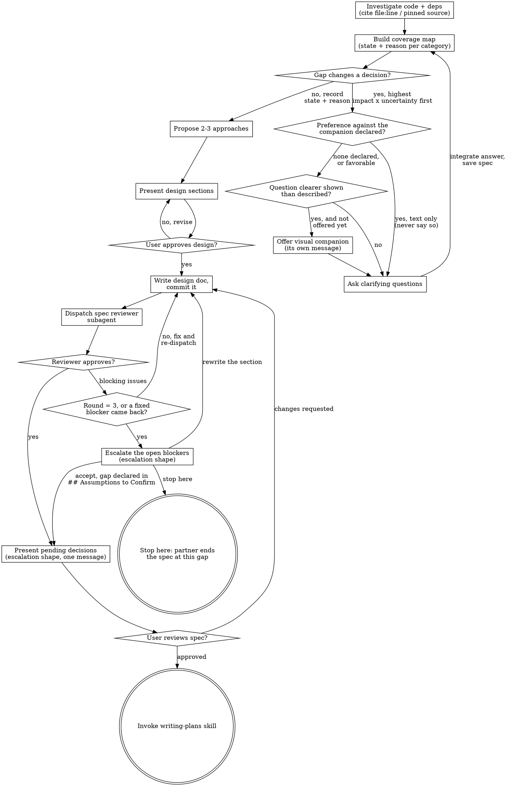

# The Process, Drawn

Every branch and back-edge of the interview: the investigation that gates the
first question, the coverage-map loop each answer re-enters, the visual
companion's two decision points, and the spec review's cap with its three
exits. `SKILL.md`'s Checklist names the same steps in the order they run —
what only this file shows is where each loop **returns to** and where the
review gate **breaks out**, which a numbered list cannot make visible at once.

Read it before your first question to the user.

