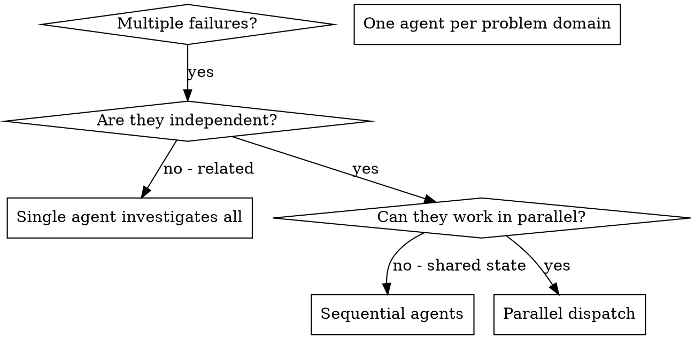

# Dispatching Parallel Agents

## Overview

You delegate tasks to specialized agents with isolated context. By precisely crafting their instructions and context, you ensure they stay focused and succeed at their task. They should never inherit your session's context or history — you construct exactly what they need. This also preserves your own context for coordination work.

When you have multiple unrelated failures (different test files, different subsystems, different bugs), investigating them sequentially wastes time. Each investigation is independent and can happen in parallel.

**Core principle:** Dispatch one agent per independent problem domain. Let them work concurrently.

## The boundary: not the tasks of a plan

**This skill does not reach the tasks of a plan under execution.** There,
superpowersplus:subagent-driven-development governs, and its rule is
unconditional: never dispatch multiple implementation subagents in parallel.
That rule wins inside a plan run, and nothing here softens it.

The boundary is easy to miss because this skill fires on its own description —
no skill routes to it — so it is reachable from inside a plan run, where it
does not belong. Two reasons it does not:

- **Edit conflict.** Plan tasks are decomposed to be reviewable one at a time,
  not to be disjoint on disk. Two implementers in the same file is a merge
  nobody asked for, discovered after both finished.
- **The next task's review depends on the last one finishing.** A task reviewer
  is handed the base test count from the previous task's review, and a diff
  range starting at the commit before its task. Run two tasks at once and
  neither number exists: the base is a moving target and the ranges overlap.

**What is left here is investigation of failures nobody planned** — a suite that
broke, several failures with different causes, no plan and no task numbering.
That case is real and this skill is for it.

## When to Use



**Use when:**
- 3+ test files failing with different root causes
- Multiple subsystems broken independently
- Each problem can be understood without context from others
- No shared state between investigations

**Don't use when:**
- Failures are related (fix one might fix others)
- Need to understand full system state
- Agents would interfere with each other

## The Pattern

### 1. Identify Independent Domains

Group failures by what's broken:
- File A tests: Tool approval flow
- File B tests: Batch completion behavior
- File C tests: Abort functionality

Each domain is independent - fixing tool approval doesn't affect abort tests.

### 2. Create Focused Agent Tasks

Each agent gets:
- **Specific scope:** One test file or subsystem
- **Clear goal:** Find the root cause of these failures
- **Constraints:** Read-only — investigate, do not edit and do not commit
- **Expected output:** The root cause with `file:line` evidence, the fix you
  would make, and whether it touches files the other investigations name

### 3. Dispatch in Parallel

Issue all three subagent dispatches in the same response — they run in parallel:

```text
Subagent (general-purpose): "Diagnose agent-tool-abort.test.ts failures"
Subagent (general-purpose): "Diagnose batch-completion-behavior.test.ts failures"
Subagent (general-purpose): "Diagnose tool-approval-race-conditions.test.ts failures"
# All three run concurrently.
```

Multiple dispatch calls in one response = parallel execution. One per response = sequential.

### 4. Read and Sequence

The parallel part ends here. When the diagnoses return:

- Read each one, and check its cited `file:line` yourself — a diagnosis is a
  claim, not evidence
- **Check for overlap:** two diagnoses naming the same file are not two
  independent fixes. Merge them into one before anything is applied
- **Apply the fixes one at a time, never in parallel.** Each one: make the
  change, run the suite, and only then start the next. This is the same rule
  superpowersplus:subagent-driven-development states for plan tasks, and it
  holds here for the same reason — two agents editing at once produce a merge
  nobody asked for, found after both finished, and a suite run between two
  simultaneous edits cannot say which one broke it
- Run the full suite once more at the end

## Agent Prompt Structure

Good agent prompts are:
1. **Focused** - One clear problem domain
2. **Self-contained** - All context needed to understand the problem
3. **Specific about output** - What should the agent return?

```markdown
Diagnose the 3 failing tests in src/agents/agent-tool-abort.test.ts:

1. "should abort tool with partial output capture" - expects 'interrupted at' in message
2. "should handle mixed completed and aborted tools" - fast tool aborted instead of completed
3. "should properly track pendingToolCount" - expects 3 results but gets 0

These look like timing/race condition issues. Your task:

1. Read the test file and understand what each test verifies
2. Trace the failure to its root cause - timing, or an actual bug?
3. Decide what the fix would be:
   - Replacing arbitrary timeouts with event-based waiting
   - A bug in the abort implementation, if you find one
   - A test expectation that no longer matches intended behavior

You are READ-ONLY: do not edit any file, and do not commit. Somebody else
applies the fixes, one at a time, after reading all three diagnoses.

Do NOT settle for "increase the timeout" - find the real cause.

Return:
- Root cause, with file:line for every claim
- The fix you would make, precisely enough for someone else to apply it
- Every file your fix would touch - the controller needs this to tell an
  overlap from three independent changes
```

## Common Mistakes

**❌ Too broad:** "Diagnose all the tests" - agent gets lost
**✅ Specific:** "Diagnose agent-tool-abort.test.ts" - focused scope

**❌ No context:** "Find the race condition" - agent doesn't know where
**✅ Context:** Paste the error messages and test names

**❌ No constraints:** Agent starts editing, and now two of them have
**✅ Constraints:** "Read-only: do not edit, do not commit"

**❌ Vague output:** "Tell me what's wrong" - you can't apply that
**✅ Specific:** "Root cause with file:line, the fix you would make, and every
file it touches"

## When NOT to Use

**Related failures:** Fixing one might fix others - investigate together first
**Need full context:** Understanding requires seeing entire system
**Exploratory debugging:** You don't know what's broken yet
**Shared state:** Agents would interfere (editing same files, using same resources)

## Real Example from Session

**Read this as a record, not as the pattern above.** It is a session that
happened, under the earlier boundary, where the three subagents edited code
and their changes were merged at the end. It is left exactly as it was run:
converting a record of what was done into the format now prescribed would
invent a session nobody had.

**What it would be today:** the same three domains diagnosed in parallel —
that part is unchanged and is what this skill is for — and then the three
fixes applied one at a time, because "no conflicts" was discovered after all
three had already edited, which is the discovery this skill no longer waits
for.

**Scenario:** 6 test failures across 3 files after major refactoring

**Failures:**
- agent-tool-abort.test.ts: 3 failures (timing issues)
- batch-completion-behavior.test.ts: 2 failures (tools not executing)
- tool-approval-race-conditions.test.ts: 1 failure (execution count = 0)

**Decision:** Independent domains - abort logic separate from batch completion separate from race conditions

**Dispatch:**
```
Agent 1 → Fix agent-tool-abort.test.ts
Agent 2 → Fix batch-completion-behavior.test.ts
Agent 3 → Fix tool-approval-race-conditions.test.ts
```

**Results:**
- Agent 1: Replaced timeouts with event-based waiting
- Agent 2: Fixed event structure bug (threadId in wrong place)
- Agent 3: Added wait for async tool execution to complete

**Integration:** All fixes independent, no conflicts, full suite green

## Verification

The agents returned diagnoses, not commits — nothing has changed on disk yet.

1. **Read each diagnosis** - The root cause with its `file:line`, and the fix
   the agent would make
2. **Order by the overlap they reported** - Each agent named whether its fix
   touches files the other investigations name
3. **Apply one fix at a time, re-running the suite after each** - A fix that
   resolves two domains makes the second unnecessary, and a fix that breaks
   another domain is caught while only one change is in play
4. **Spot check** - Agents can make systematic errors
