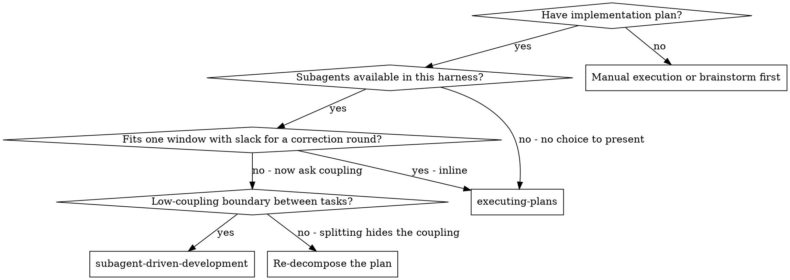

# Subagent-Driven Development

Execute plan by dispatching a fresh implementer subagent per task, a task review (spec compliance + code quality) after each, and two gates at the end: a task-by-task conformance audit, then a broad whole-branch review.

**Why subagents:** You delegate tasks to specialized agents with isolated context. By precisely crafting their instructions and context, you ensure they stay focused and succeed at their task. They should never inherit your session's context or history — you construct exactly what they need. This also preserves your own context for coordination work.

**Core principle:** Fresh subagent per task + task review (spec + quality) + broad final review = high quality, fast iteration

**Narration:** between tool calls, narrate at most one short line — the
ledger and the tool results carry the record.

**When you do escalate to your human partner** — the plan is wrong, an iteration cap was hit, residuals were parked — use the shape below. A subagent's report to you is unchanged; that is machine to machine.

**Escalation shape** (detail and a worked example: [escalation-format.md](../using-superpowers/references/escalation-format.md)):
1. **What breaks or costs** if nothing is decided — one sentence, the consequence and not the mechanism.
2. **2–4 options with the cost of each**, always including doing nothing now.
3. **A recommendation naming which source backs it** — a project pattern at `file:line`, the dependency's official docs, or general practice declared as such.
4. **Before sending, reread the whole message once**, looking for terms someone outside this project would not know. Rewrite each in plain language, or define it in the sentence that uses it. A gate verdict name (`LOST IN TRANSLATION`, `INVENTED SCOPE`, …) appears only in parentheses, never carrying the explanation.

**Continuous execution:** Do not pause to check in with your human partner
between tasks. **You are authorized to proceed alone on everything this skill
gives you a rule for** — a status to handle, a loop to run, a cap to respect, a
finding to park with a ruling — and that covers most of a run. Where consulting
is required instead, the rule requiring it says so at the point of decision;
this paragraph does not carry their list, and a stop this skill did not ask for
is a stop you invented. "Should I continue?" prompts and progress summaries
waste their time — they asked you to execute the plan, so execute it.

**Progress reports.** Executing without stopping is not executing in
silence. Report to your human partner at four fixed points, one line each:

- **Starting:** how many tasks, that this is the subagent path, and the
  ledger path where progress lives.
- **Each task done:** `task N of M complete — <short title>`, and what
  comes next.
- **Entering a fix round:** which round, out of the cap of the loop you are
  in — five in the task loop below, three in the final fix wave
  ([references/final-review.md](references/final-review.md)) — and why in a few words. There are two
  caps and one report; naming the wrong one tells your partner they have
  more rounds left than they do.
- **Finishing:** what was delivered, and which gate runs next.

These are not the check-ins the paragraph above forbids. A report asks
nothing and waits for nothing — you keep going in the same breath. It also
carries no gate vocabulary: `NOT DELIVERED`, `INVENTED SCOPE`, severity
labels and the rest stay in the machine-to-machine reports where they are
precise. Past two lines it has become the progress summary that paragraph
rules out; shorten it.

**No gate can check any of this, and none is asked to.** These reports
happen in the chat, which no reviewer, audit or re-review ever reads. Do not
build a verifier for them, and do not mirror them into the ledger so that
one becomes possible — the ledger exists to resume work, not to prove
somebody was told.

## When to Use

**Coupling here means one thing.** Tasks are coupled when they have a
shared file, shared interface, or shared state — any one of the three is
enough — and the boundary is where they share **none** of them. That is the
whole test — the full statement of both questions, and why a subagent is
context-budget management rather than a quality technique, is in
[execution-path.md](../writing-plans/references/execution-path.md).

**The plan header's `**Execution:**` field may already answer this** — when
superpowersplus:writing-plans handed the plan over, your partner picked the
path and it was written there. The graph is for a plan that arrives without
one, and for checking that the field still fits what you are looking at.

**vs. Executing Plans (the inline path):** both run in this session — what
differs is what each one buys.
- Fresh subagent per task (no context pollution)
- Review after each task (spec compliance + code quality), broad review at the end
- Progress written to a file, so an interruption resumes from it; the inline
  path tracks with session todos, which do not outlive the session. The
  measured difference is in [writing-plans](../writing-plans/SKILL.md),
  section "Execution Handoff"

## The Process

Setup, then per task: dispatch an implementer, review the task, fix-loop what
the review opened, log the completion. After the last one, two whole-branch
gates and a fix wave. Each of those is a section below, in the order it runs.

**The whole flow drawn as one graph is in
[references/process-graph.md](references/process-graph.md) — open it before
dispatching Task 1.** The sections below run in order but cannot show where a
loop returns to or where a cap breaks out; that is what the graph is for, and
it is the only place the shape is visible at once.

## Setup

Ensure the work happens in an isolated workspace: use
superpowersplus:using-git-worktrees to create one or verify the existing one.
Never start implementation on a main/master branch without your human
partner's explicit consent.

Conversation memory does not survive compaction. In real sessions,
controllers that lost their place have re-dispatched entire completed task
sequences — the single most expensive failure observed. Track progress in
a ledger file, not only in todos.

- Each plan owns a workspace: at skill start, run this skill's
  `scripts/sdd-workspace PLAN_FILE` — it prints the plan's git-ignored
  directory (`<repo-root>/.superpowers/sdd/<plan-basename>/`), home to
  every artifact for THIS plan: ledger, briefs, reports, review packages.
  Another plan's directory is never yours to read or write.
- Check for this plan's ledger at `<workspace>/progress.md`. **A ledger is
  there, or the branch already carries commits you did not make this session?
  You are resuming: read [references/resuming.md](references/resuming.md) and
  follow it before dispatching anything.** How to read the ledger, how to
  check it against `git log`, and the two shapes where the ledger is the thing
  missing are all there.
- No ledger and no prior work: create it with its identity as the first line,
  `# SDD ledger — plan: <plan file path>`, and continue here.

Read the plan once, note its context and Global Constraints, and create a
todo per task.

Read the plan header's `**Execution:**` field. It records the path this plan
was handed to and where its progress was being kept. If it names the inline
path, you are resuming by a different route than the one it started on — stop
and present that before dispatching anything, in the escalation shape above,
with what each side costs from [references/resuming.md](references/resuming.md). A plan with no such
field is a plan written before the field existed; that is not an error —
proceed, and write the path you are taking into it.

Read the spec the plan cites in its `**Source spec:**` header line. The plan
is a translation of it, and the conformance audit at the end traces one
against the other. A plan citing no spec is an entry blocker: get the path
from your human partner before dispatching Task 1, never start and sort it
out later.

Before dispatching Task 1, scan the plan once for conflicts:

- tasks that contradict each other or the plan's Global Constraints
- anything the plan explicitly mandates that the review rubric treats as a
  defect (a test that asserts nothing, verbatim duplication of a logic block)

Present everything you find to your human partner as one batched question —
each finding beside the plan text that mandates it, asking which governs —
before execution begins, not one interrupt per discovery mid-plan. If the
scan is clean, proceed without comment. The review loop remains the net for
conflicts that only emerge from implementation.

## Model Selection

**Which model for which role is in
[references/model-selection.md](references/model-selection.md) — open it
before each dispatch and pick the tier there.** It carries the role tiers,
the fix-loop escalation, why turn count beats token price, and the task
complexity signals.

**Always specify the model explicitly when dispatching a subagent.** An
omitted model inherits your session's model — often the most capable and
most expensive — which silently defeats this section.

## The Task Loop

Everything you paste into a dispatch prompt — and everything a subagent
prints back — stays resident in your context for the rest of the session
and is re-read on every later turn. Hand artifacts over as files.

### 1. Dispatch the implementer

Record BASE (`git rev-parse HEAD`) before dispatching — the review package
and fix-round diffs need it.

- **Task brief:** before dispatching an implementer, run this skill's
  `scripts/task-brief PLAN_FILE N` — it extracts the task's full text to a
  uniquely named file and prints the path. Compose the dispatch so the
  brief stays the single source of
  requirements. Your dispatch should contain: (1) one line on where this
  task fits in the project; (2) the brief path, introduced as "read this
  first — it is your requirements, with the exact values to use verbatim";
  (3) the plan's Global Constraints, copied verbatim — the same block the
  task reviewer is handed, so the implementer is held to what it was given
  and not to a document it never saw; (4) interfaces and decisions from
  earlier tasks that the brief cannot know; (5) your resolution of any
  ambiguity you noticed in the brief; (6) the report-file path and report
  contract. Exact values (numbers,
  magic strings, signatures, test cases) appear only in the brief. Never
  make a subagent read the whole plan file.
- **Report file:** name the implementer's report file after the brief
  (brief `…/task-N-brief.md` → report `…/task-N-report.md`) and put it in
  the dispatch prompt. The implementer writes the full report there and
  returns only status, commits, a one-line test summary, and concerns.
- A dispatch prompt describes one task, not the session's history. Do not
  paste accumulated prior-task summaries ("state after Tasks 1-3") into
  later dispatches — a real session's dispatch hit 42k chars of which 99%
  was pasted history. A fresh subagent needs its task, the interfaces it
  touches, and the global constraints. Nothing else.
- If an earlier task parked a finding in the area this task touches, carry
  a pointer to that ledger entry in the dispatch.
- Record the implementer's agent identity from the dispatch result —
  fix-loop rounds 1-3 resume this agent.
- Never dispatch multiple implementation subagents in parallel (conflicts).

Template: [implementer-prompt.md](implementer-prompt.md)

### 2. Handle the report

Implementer subagents report one of four statuses. Handle each appropriately:

**DONE:** Generate the review package (`scripts/review-package PLAN_FILE BASE HEAD`, from this skill's directory — it prints the unique file path it wrote; BASE is the commit you recorded before dispatching the implementer — never `HEAD~1`, which silently drops all but the last commit of a multi-commit task), then dispatch the task reviewer with the printed path.

**DONE_WITH_CONCERNS:** The implementer completed the work but flagged doubts. Read the concerns before proceeding. If the concerns are about correctness or scope, address them before review. If they're observations (e.g., "this file is getting large"), note them and proceed to review.

**NEEDS_CONTEXT:** The implementer needs information that wasn't provided. Provide the missing context and re-dispatch.

**BLOCKED:** The implementer cannot complete the task. Assess the blocker:
1. If it's a context problem, provide more context and re-dispatch with the same model
2. If the task requires more reasoning, re-dispatch with a more capable model
3. If the task is too large, break it into smaller pieces
4. If the plan itself is wrong, escalate to the human

**Never** ignore an escalation or force the same model to retry without changes. If the implementer said it's stuck, something needs to change.

If the implementer asks questions — before starting or mid-task — answer
clearly and completely, provide additional context if needed, and don't
rush it into implementation.

### 3. Review the task

Per-task reviews are task-scoped gates. The broad review happens once, at the
final whole-branch review. Never skip the task review, and never accept a
report missing either verdict — spec compliance AND task quality are both
required. Implementer self-review never replaces the task review; both are
needed.

- Hand the reviewer its diff as a file: run this skill's
  `scripts/review-package PLAN_FILE BASE HEAD` and pass the reviewer the file path
  it prints (or, without bash: `git log --oneline`, `git diff --stat`,
  and `git diff -U10` for the range, redirected to one uniquely named
  file). The output never enters your own context, and the reviewer sees
  the commit list, stat summary, and full diff with context in one Read
  call. Use the BASE you recorded before dispatching the implementer —
  never `HEAD~1`, which silently truncates multi-commit tasks. Never
  dispatch a task reviewer without a diff file.
- **Reviewer inputs:** the task reviewer gets three paths — the same brief
  file, the report file, and the review package — plus the global
  constraints that bind the task, the test command, and the base test count.
- **`[VERIFICATION_INSTRUMENTS]`:** the instrument each of this task's
  criteria names, copied from the plan's Verification Matrix with its
  evidence class. This is what the reviewer re-runs.
- **`[TEST_COMMAND]`:** **required only when the task carries at least one
  `behavioral` criterion** — the command that runs those tests, taken from
  the matrix or, failing that, the repository's runner config
  (`package.json` scripts, `Makefile`, `pytest.ini`, the CI workflow).
  Confirm it exists before passing it — an invented command sends the
  reviewer chasing a runner error instead of the task. Scope it to the
  task's tests where the runner allows; the full suite is the fallback.
  **A task with no `behavioral` criterion has no admissible value for this
  field — leave it out.** Deriving one anyway is how a `structural` task
  acquires a test nobody asked for.
- **`[BASE_TEST_COUNT]`:** the test count at BASE, so the reviewer can see
  whether tests disappeared — **under the same condition as
  `[TEST_COMMAND]`**, since a task that runs no tests has none to lose. You
  have it from the previous task's review, which reported its counts. No
  prior run — Task 1, a new suite, a runner that prints no total? Pass
  `unknown` and say why: the reviewer falls back to reading the diff for
  tests deleted, renamed away, or newly skipped. Never back-fill it from the
  implementer's report — that number is part of what is under audit.
- The global-constraints block you hand the reviewer is its attention
  lens. Copy the binding requirements verbatim from the plan's Global
  Constraints section or the spec: exact values, exact formats, and the
  stated relationships between components ("same layout as X", "matches
  Y"). The reviewer's template already carries the process rules (YAGNI,
  test hygiene, review method) — the constraints block is for what THIS
  project's spec demands.
- Do not add open-ended directives like "check all uses" or "run race tests
  if useful" without a concrete, task-specific reason
- The reviewer re-runs the task's verification instruments itself. The
  implementer's report is a claim about a run nobody else watched, written
  by the author of what is being judged — it is not evidence. Hand the
  reviewer the instruments from the plan's Verification Matrix, and, **where
  the task carries a `behavioral` criterion**, the test command and the base
  count. Never a "tests already ran" note, and never a command derived for a
  task that asked for none
- Do not pre-judge findings for the reviewer — never instruct a reviewer to
  ignore or not flag a specific issue. If you believe a finding would be a
  false positive, let the reviewer raise it and adjudicate it in the review
  loop. If the prompt you are writing contains "do not flag," "don't treat X
  as a defect," "at most Minor," or "the plan chose" — stop: you are
  pre-judging, usually to spare yourself a review loop.
The task reviewer may report "⚠️ Cannot verify from diff" items — requirements
that live in unchanged code or span tasks. These do not block the rest of the
review, but you must resolve each one yourself before marking the task
complete: you hold the plan and cross-task context the reviewer
lacks. If you confirm an item is a real gap, treat it as a failed spec
review — it enters the fix loop with the other findings.

Template: [task-reviewer-prompt.md](task-reviewer-prompt.md)

**Append one row to the project's `docs/superpowers/review-yield.md`**, face
`task <N>` — columns and the header to create it with are in
[review-yield.md](../requesting-code-review/references/review-yield.md).

### 4. The fix loop

The loop triggers when the review reports spec ❌, any Critical or Important
finding, or a ⚠️ item you confirmed as a real gap.

Before the loop starts, two routes leave it immediately:

- Record Minor findings in the progress ledger as you go
  (`Task <N>: minor (deferred): <one-liner>`), and point the final
  whole-branch review at that list so it can triage which must be fixed
  before merge. A roll-up nobody reads is a silent discard. Minor findings
  never enter the loop.
- A finding labeled plan-mandated — or any finding that conflicts with
  what the plan's text requires — is the human's decision, like any plan
  contradiction: present the finding and the plan text, and ask which
  governs, in the escalation shape above.
  Do not dismiss the finding because the plan mandates it, and do not
  dispatch a fix that contradicts the plan without asking.
Everything else enters the loop. A fix round is one fix dispatch plus one
scoped re-review. Five rounds maximum per task:

**Rounds 1-3 — resume the original implementer.** Send it the open findings
verbatim. Its context is intact: it knows the task, the code, and its own
choices. If your harness cannot send another message to a live subagent,
dispatch a fresh implementer carrying the brief path, the report-file path,
and the findings — the report file is the persistent memory either way.

**Rounds 4-5 — dispatch a fresh implementer on a more capable model** (per
Model Selection), with the brief path, the report-file path, the open
findings, and this framing: "A prior implementer attempted this task
[N] times; you own it now. Read the report file for what was tried." A loop
that survives three resumes usually means the implementer cannot see its
own problem — fresh eyes and a capability bump in one move.

**Every round, either way:** the implementer fixes, re-runs the verification
instrument each amended criterion names, appends its fix report to the same
report file, and returns the short contract. Before re-dispatching the
reviewer, confirm the fix report contains, for every criterion it touched, the
instrument re-run and its result — the covering tests, the command and the
output where the criterion is `behavioral`; the read-only check or the located
range otherwise. Dispatch the re-review once each touched criterion has one.
Name the covering test files in the fix message where there are tests — a
one-line fix does not need the whole suite.

**A finding the implementer disputes.** The fix prompt has the implementer
read the code a finding names before implementing it, and report DISPUTED —
with the `file:line` that contradicts it — rather than fix what the code
says is not there. Four rules keep that from becoming the cheap way out of a
round:

- **The re-reviewer rules on a dispute, never you.** It reads the cited code
  itself and returns CONFIRMED (the finding stands) or WITHDRAWN (it leaves
  the list). This is not the early adjudication the breaker forbids below:
  it is a reviewer's finding checked by a reviewer — the same
  author≠verifier split the rest of this flow runs on. You still adjudicate
  only at the cap. The author never rules on its own dispute.
- **A dispute does not close a round.** It rides into the same round's
  re-review alongside that round's fixes. There is no path where disputing
  is cheaper than fixing.
- **A dispute the re-reviewer rejects costs the round.** A CONFIRMED finding
  counts NOT ADDRESSED against the round cap, like any finding still open —
  no new counter, the existing cap covers it. Disputing everything burns the
  cap at exactly the speed of fixing nothing.
- **A dispute still open at the cap escalates.** Never park it: parking a
  dispute is you ruling on it. Report it with the others in the escalation
  shape above, carrying BOTH pieces of evidence — the finding and the
  `file:line` contradiction — and let your human partner rule.

DISPUTED, CONFIRMED and WITHDRAWN are the only dispute states.

**The re-review is scoped.** Run `scripts/review-package PLAN_FILE FIX_BASE HEAD`
where FIX_BASE is the head the previous review saw, and dispatch
[re-review-prompt.md](re-review-prompt.md) with the findings list, the
brief, the report file, the printed diff path, and the same test command
and counts the task review reported — the re-reviewer runs the tests too.
The re-reviewer verdicts each finding ADDRESSED or NOT ADDRESSED and flags
new breakage in the fix diff only. New Critical/Important breakage in the fix diff joins the open
findings list. Out-of-scope observations go to the ledger as deferred
minors — they never extend the loop.

**After each round,** append to the ledger:
`Task <N>: fix round <R>/5 (<X> addressed, <Y> open — <finding one-liners>; commits <a7>..<b7>)`

Never fix findings yourself in the controller session — your context stays
clean for coordination, and controller fixes skip review.

**The breaker.** When round 5's re-review still leaves findings open, stop
dispatching. Adjudicate each open finding yourself — you hold the plan and
the cross-task context the reviewer lacks:

- **The reviewer is wrong, or the point is contestable:** park it —
  `Task <N>: parked — <finding> — ruling: <why the code stands>`. The final
  review sees both sides.
- **Real, but nothing downstream builds on it:** park it the same way, with
  a ruling that says it's real and deferred.
- **Real and load-bearing** — a later task builds on it, or it reveals a
  plan defect: STOP. Append `Task <N>: BLOCKED — <reason>` and report to
  your human partner in the escalation shape above — the finding, the plan
  text it collides with, and the fix history are the evidence behind it,
  not the opening. Parking a structural failure lets every dependent task
  build on it and hands the final review a problem it cannot fix either.

Adjudicate only at the cap. Adjudicating earlier to end a loop is
pre-judging with a different name. Every adjudication is a ledger entry —
a silent discard is forbidden.

**Append one row to the project's `docs/superpowers/review-yield.md`** per
re-review, face `re-review <N>` — columns and the header to create it with
are in [review-yield.md](../requesting-code-review/references/review-yield.md).

### 5. Complete the task

When the review comes back clean — or every open finding is parked with a
ruling at the cap — append the completion line to the ledger in the same
message as your other bookkeeping:

- `Task <N>: complete (commits <base7>..<head7>, review clean)`
- `Task <N>: complete (commits <base7>..<head7>, <K> parked)` after a
  tripped breaker

Then mark the todo complete and move on. Never move to the next task while
the review has open Critical/Important issues that are neither fixed nor
parked-with-ruling at the cap.

## Final Review

Two gates and a fix wave run after the last task. The protocol for all three
— what to dispatch, in what order, with which inputs, and the caps — is in
[references/final-review.md](references/final-review.md). Open it when the
last task's completion line is in the ledger, before dispatching either gate.

## Finish

When both final gates are clean — the conformance audit PASSes and the
whole-branch review's fixes are merged — delete this plan's workspace
(`rm -rf <workspace>`) — the git history is the record now. Sibling
directories belong to other plans; leave them alone.

Use superpowersplus:finishing-a-development-branch.

## Common Rationalizations

| Excuse | Reality |
|--------|---------|
| "Close enough on spec compliance" | Reviewer found spec gaps = not done. Fix or hit the cap and adjudicate — those are the only exits. |
| "I'll fix it myself, dispatching is overhead" | Controller fixes pollute your context and skip review. Resume the implementer. |
| "One more round will converge" | Past the cap, rounds don't converge — the failure is structural. Adjudicate and route. |
| "The reviewer will just find something new anyway" | Scoped re-reviews verify fixes; they cannot wander. New findings on untouched code go to the ledger, not the loop. |
| "This finding is obviously wrong, I'll drop it" | You adjudicate only at the cap, and every ruling is a ledger entry. Silent discards are forbidden. |
| "The fix was small, skip the re-review" | Unreviewed fixes are how regressions land. Every round ends with a scoped re-review. |
| "Reviews slow the loop down" | The loop without reviews is just unverified churn. Reviews are the loop's brakes and steering. |
| "Ledger bookkeeping is overhead" | The ledger is what survives compaction. Controllers without one have re-dispatched entire completed task sequences. |
| "Every task was reviewed, the final audit is redundant" | Task reviews see one diff each. None of them can see a task that was never dispatched — that task has no diff and no reviewer. |
| "The audit gap is minor, I'll park it now" | Parking happens after fix wave 3, never before. FALSE COMPLETION is never parked at all. |

