# The Process, Drawn

Every branch and back-edge of the run: the resume gate, the per-task cluster
with its exits and its breaker, the two final gates, and the fix wave.
`SKILL.md` describes the same steps in the order they run, one section each —
what only this file shows is where each loop **returns to** and where each cap
**breaks out**, which prose spread over five sections cannot make visible at
once.

**One thing it deliberately does not draw:** the four implementer statuses of
`SKILL.md`'s "Handle the report" — DONE, DONE_WITH_CONCERNS, NEEDS_CONTEXT,
BLOCKED. Those are responses to one node's output, not paths through the run,
and drawing them would grow the graph to restate a table five lines long.

Read it before dispatching Task 1.

```dot
digraph process {
    rankdir=TB;

    subgraph cluster_per_task {
        label="Per Task";
        "Dispatch implementer subagent (../implementer-prompt.md)" [shape=box];
        "Implementer asks questions?" [shape=diamond];
        "Answer questions, provide context" [shape=box];
        "Implementer implements, tests, commits, self-reviews" [shape=box];
        "Generate review package, dispatch task reviewer (../task-reviewer-prompt.md)" [shape=box];
        "Spec ✅ and quality approved?" [shape=diamond];
        "Only Minor findings?" [shape=diamond];
        "Ledger the minors as deferred;\npoint the final review at them" [shape=box];
        "Finding conflicts with plan text?" [shape=diamond];
        "Ask human partner which governs" [shape=box];
        "Which governs?" [shape=diamond];
        "Fix round R of 5 (fix, or DISPUTE with file:line): R≤3 resume implementer; R≥4 fresh implementer, more capable model" [shape=box];
        "Dispatch scoped re-review (../re-review-prompt.md): verdict fixes, rule disputes" [shape=box];
        "All findings addressed?" [shape=diamond];
        "R = 5?" [shape=diamond];
        "Adjudicate each open finding" [shape=box];
        "Any load-bearing finding?" [shape=diamond];
        "STOP: report BLOCKED to human partner" [shape=box];
        "Park findings in ledger with rulings" [shape=box];
        "Append completion to ledger, mark todo complete" [shape=box];
    }

    "Setup: worktree, ledger check, read plan + cited spec, pre-flight review" [shape=box];
    "Resuming? (a ledger, commits you did not make\nthis session, or Execution names the inline path)" [shape=diamond];
    "Resume route (resuming.md): reconstruct,\ncheck against git log, present, wait for one answer" [shape=box];
    "More tasks remain?" [shape=diamond];
    "Dispatch conformance audit (superpowersplus:final-branch-audit)" [shape=box];
    "Dispatch final code reviewer (../../requesting-code-review/code-reviewer.md)" [shape=box];
    "Audit gaps + review findings all addressed?" [shape=diamond];
    "Fix wave iteration I of 3?" [shape=diamond];
    "Fix wave iteration: ONE fix dispatch (audit gaps + findings), one scoped re-review" [shape=box];
    "Adjudicate residuals (FALSE COMPLETION is never parked)" [shape=box];
    "Gates settled — clean, or residuals ruled:\ndelete this plan's workspace" [shape=box];
    "Use superpowersplus:finishing-a-development-branch" [shape=box style=filled fillcolor=lightgreen];

    "Setup: worktree, ledger check, read plan + cited spec, pre-flight review" -> "Resuming? (a ledger, commits you did not make\nthis session, or Execution names the inline path)";
    "Resuming? (a ledger, commits you did not make\nthis session, or Execution names the inline path)" -> "Resume route (resuming.md): reconstruct,\ncheck against git log, present, wait for one answer" [label="yes - before dispatching anything"];
    "Resume route (resuming.md): reconstruct,\ncheck against git log, present, wait for one answer" -> "Dispatch implementer subagent (../implementer-prompt.md)";
    "Resuming? (a ledger, commits you did not make\nthis session, or Execution names the inline path)" -> "Dispatch implementer subagent (../implementer-prompt.md)" [label="no"];
    "Dispatch implementer subagent (../implementer-prompt.md)" -> "Implementer asks questions?";
    "Implementer asks questions?" -> "Answer questions, provide context" [label="yes"];
    "Answer questions, provide context" -> "Implementer implements, tests, commits, self-reviews";
    "Implementer asks questions?" -> "Implementer implements, tests, commits, self-reviews" [label="no"];
    "Implementer implements, tests, commits, self-reviews" -> "Generate review package, dispatch task reviewer (../task-reviewer-prompt.md)";
    "Generate review package, dispatch task reviewer (../task-reviewer-prompt.md)" -> "Spec ✅ and quality approved?";
    "Spec ✅ and quality approved?" -> "Append completion to ledger, mark todo complete" [label="yes"];
    "Spec ✅ and quality approved?" -> "Only Minor findings?" [label="no"];
    "Only Minor findings?" -> "Ledger the minors as deferred;\npoint the final review at them" [label="yes - they never enter the loop"];
    "Ledger the minors as deferred;\npoint the final review at them" -> "Append completion to ledger, mark todo complete";
    "Only Minor findings?" -> "Finding conflicts with plan text?" [label="no"];
    "Finding conflicts with plan text?" -> "Ask human partner which governs" [label="yes"];
    "Ask human partner which governs" -> "Which governs?";
    "Which governs?" -> "Fix round R of 5 (fix, or DISPUTE with file:line): R≤3 resume implementer; R≥4 fresh implementer, more capable model" [label="the finding"];
    "Which governs?" -> "Append completion to ledger, mark todo complete" [label="the plan text\n(ledger the ruling)"];
    "Finding conflicts with plan text?" -> "Fix round R of 5 (fix, or DISPUTE with file:line): R≤3 resume implementer; R≥4 fresh implementer, more capable model" [label="no"];
    "Fix round R of 5 (fix, or DISPUTE with file:line): R≤3 resume implementer; R≥4 fresh implementer, more capable model" -> "Dispatch scoped re-review (../re-review-prompt.md): verdict fixes, rule disputes";
    "Dispatch scoped re-review (../re-review-prompt.md): verdict fixes, rule disputes" -> "All findings addressed?";
    "All findings addressed?" -> "Append completion to ledger, mark todo complete" [label="yes"];
    "All findings addressed?" -> "R = 5?" [label="no"];
    "R = 5?" -> "Fix round R of 5 (fix, or DISPUTE with file:line): R≤3 resume implementer; R≥4 fresh implementer, more capable model" [label="no - next round"];
    "R = 5?" -> "Adjudicate each open finding" [label="yes - breaker trips"];
    "Adjudicate each open finding" -> "Any load-bearing finding?";
    "Any load-bearing finding?" -> "STOP: report BLOCKED to human partner" [label="yes"];
    "Any load-bearing finding?" -> "Park findings in ledger with rulings" [label="no"];
    "Park findings in ledger with rulings" -> "Append completion to ledger, mark todo complete";
    "Append completion to ledger, mark todo complete" -> "More tasks remain?";
    "More tasks remain?" -> "Dispatch implementer subagent (../implementer-prompt.md)" [label="yes"];
    "More tasks remain?" -> "Dispatch conformance audit (superpowersplus:final-branch-audit)" [label="no"];
    "Dispatch conformance audit (superpowersplus:final-branch-audit)" -> "Dispatch final code reviewer (../../requesting-code-review/code-reviewer.md)";
    "Dispatch final code reviewer (../../requesting-code-review/code-reviewer.md)" -> "Audit gaps + review findings all addressed?";
    "Audit gaps + review findings all addressed?" -> "Gates settled — clean, or residuals ruled:\ndelete this plan's workspace" [label="yes"];
    "Audit gaps + review findings all addressed?" -> "Fix wave iteration I of 3?" [label="no"];
    "Fix wave iteration I of 3?" -> "Fix wave iteration: ONE fix dispatch (audit gaps + findings), one scoped re-review" [label="I < 3 - next iteration"];
    "Fix wave iteration I of 3?" -> "Adjudicate residuals (FALSE COMPLETION is never parked)" [label="I = 3 - cap"];
    "Fix wave iteration: ONE fix dispatch (audit gaps + findings), one scoped re-review" -> "Audit gaps + review findings all addressed?";
    "Adjudicate residuals (FALSE COMPLETION is never parked)" -> "Gates settled — clean, or residuals ruled:\ndelete this plan's workspace";
    "Gates settled — clean, or residuals ruled:\ndelete this plan's workspace" -> "Use superpowersplus:finishing-a-development-branch";
}
```

